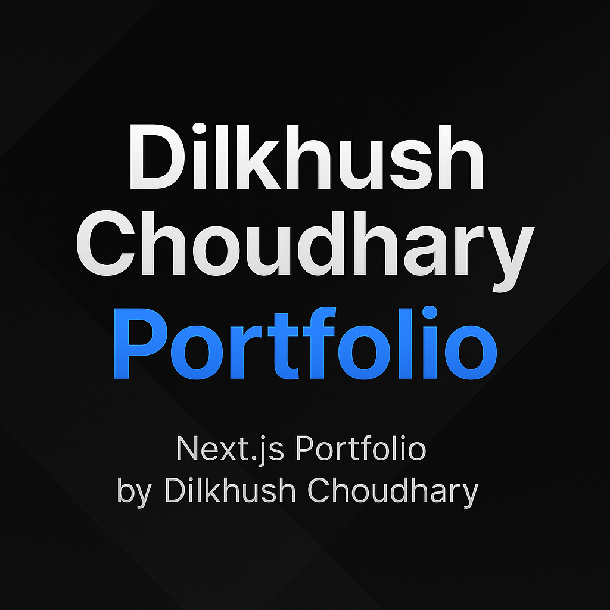

<div align="center">
  
</div>

# Dilkhush.dev – Experience Engineered Portfolio

> A cinematic, conversion-driven portfolio built with Next.js 15, Framer Motion, and a bespoke content layer.

This codebase powers my public site (**[dilkhush.dev](https://dilkhush.dev)**). It blends interactive storytelling, measurable outcomes, and DX best practices so recruiters and founders can experience more than a static resume.

## ✨ Highlights

- **Immersive hero + retro easter eggs** powered by Framer Motion, Konami-mode styling, and WebGL-friendly gradients.
- **Content-driven architecture** – projects, skills, and experience streamed from typed data modules and ready for CMS/MDX expansion.
- **Human + machine friendly metadata** using Next.js App Router `Metadata` + dynamic Open Graph image pipeline.
- **Accessibility-conscious flair** – prefers-reduced-motion fallbacks, keyboard-safe focus styling, and pointer-aware custom cursor.
- **Lead capture engine** – contact form validated by Zod and routed through Resend with graceful degradation.
- **Production-primed** – ESLint flat config, strict TypeScript, Tailwind design tokens, analytics hooks, and Vercel-ready configuration.

## 🧱 Stack

- [Next.js 15 App Router](https://nextjs.org/)
- [React 19](https://react.dev/)
- [TypeScript](https://www.typescriptlang.org/)
- [Tailwind CSS](https://tailwindcss.com/) with custom tokens
- [Framer Motion](https://www.framer.com/motion/)
- [next-themes](https://github.com/pacocoursey/next-themes) for adaptive theming
- [Resend](https://resend.com/) (optional) for email automations
- [Zod](https://zod.dev/) for form validation

## 🚀 Getting Started

```bash
pnpm install     # or npm/yarn/bun
pnpm dev         # start dev server at http://localhost:3000
```

### Environment Variables

Create `.env.local` with the following (optional) keys:

```bash
RESEND_API_KEY=your_resend_api_key
CONTACT_TO_EMAIL=hello@dilkhush.dev
CONTACT_FROM_EMAIL=portfolio@dilkhush.dev
```

Without these, the contact endpoint falls back to a no-op response.

## 🧰 Scripts

| Command        | Description                                  |
|----------------|----------------------------------------------|
| `pnpm dev`     | Run the Next.js dev server                   |
| `pnpm build`   | Create a production build                    |
| `pnpm start`   | Serve the production build                   |
| `pnpm lint`    | Run ESLint with the Next.js config           |

## 🗺️ Roadmap

- Add MDX support with Contentlayer for full case studies.
- Introduce analytics dashboards & heatmaps inside the UI.
- Ship Playwright visual regression tests for animations.
- Build a “lab” route showcasing experiments and prototypes.

## 📄 License

Copyright © Dilkhush Choudhary.  
The code is shared for portfolio transparency—please reach out before reusing significant chunks.
